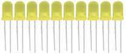
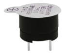
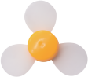
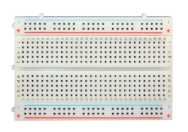

产品简介与清单
==============

**1.产品简介：**

你想学习编程知识吗?

| 只要你对科学充满热情，敢于探索新事物，这个Keyes
  入门学习套件基础工具包一定是你的最佳选择。这个工具包是一款基于Arduino的scratch图形化编程、mixly图形化编程和C语言编程等三种编程方式的学习工具包。用一个控制器（Plus
| 控制板），许多传感器/模块和电子元件，你可以做许多精彩的DIY项目。该工具包的附带20个项目教程，每个教程都有详细的接线图、元件知识和迷人的项目代码等，完全适合初学者。你可以学习电子、物理、科学和编程很多知识。

**2.清单：**

当收到这个Keyes
入门学习套件基础工具包的时候，首先看到是一个包装精美的外盒，每个配件被安全且有序的装在外盒里面的小袋子里，先来清点一下：\ **(KE3014含Plus开发板，KE3013不含Plus开发板)**

.. container:: table-wrapper

   +---------+---------+---------+---------+---------+---------+---------+
   | |i      | |i      | |i      | |i      | |i      | |i      | |i      |
   | mage71| | mage72| | mage73| | mage74| | mage75| | mage76| | mage77| |
   +=========+=========+=========+=========+=========+=========+=========+
   | Plus    | 蓝色    | 红色    | 黄色    | 绿色    | 白色    | RGB*1   |
   | 开      | LED*10  | LED*10  | LED*10  | LED*10  | LED*10  |         |
   | 发板*1  |         |         |         |         |         |         |
   +---------+---------+---------+---------+---------+---------+---------+
   | |i      | |i      | |i      | |i      | |i      | |i      | |i      |
   | mage78| | mage79| | mage80| | mage81| | mage82| | mage83| | mage84| |
   +---------+---------+---------+---------+---------+---------+---------+
   | 220Ω    | 10KΩ    | 1KΩ     | 4.7KΩ   | 10KΩ电  | 有源蜂  | 无源蜂  |
   | 电阻*10 | 电阻*10 | 电阻*10 | 电阻*10 | 位器*1  | 鸣器*1  | 鸣器*1  |
   +---------+---------+---------+---------+---------+---------+---------+
   | |i      | |i      | |i      | |i      | |i      | |i      | |i      |
   | mage85| | mage86| | mage87| | mage88| | mage89| | mage90| | mage91| |
   +---------+---------+---------+---------+---------+---------+---------+
   | 按键    | 倾斜    | 光敏    | 火焰传  | 10K热敏 | 黄帽*2  | 蓝帽*2  |
   | 开关*4  | 开关*1  | 电阻*3  | 感器*1  | 电阻*1  |         |         |
   +---------+---------+---------+---------+---------+---------+---------+
   | |i      | |i      | |i      | |i      | |i      | |i      | |i      |
   | mage92| | mage93| | mage94| | mage95| | mage96| | mage97| | mage98| |
   +---------+---------+---------+---------+---------+---------+---------+
   | IC      | 一位数  | 四位数  | 8\      | 1602    | S8050三 | S8550三 |
   | 7       | 码管*1  | 码管*1  |  *8点阵 | I2C LCD | 极管*2  | 极管*2  |
   | 4HC595N |         |         | 屏*\ 1  | \*1     |         |         |
   | \*1     |         |         |         |         |         |         |
   +---------+---------+---------+---------+---------+---------+---------+
   | |i      | |im     | |im     | |im     | |im     | |im     | |im     |
   | mage99| | age100| | age101| | age102| | age103| | age104| | age105| |
   +---------+---------+---------+---------+---------+---------+---------+
   | 风      | 直流    | 面      | 公      | 400孔面 | USB线*1 | 电      |
   | 扇叶*1  | 电机*1  | 包板连  | 对母杜  | 包板*1  |         | 阻卡*1  |
   |         |         | 接线*30 | 邦线*10 |         |         |         |
   +---------+---------+---------+---------+---------+---------+---------+

.. |image1| image:: media/d1918aec02b05734a1d32592a46ddd1a.png
.. |image2| image:: media/5a1d3dbf0c5daf6136044b828a777acd.png
.. |image3| image:: media/cddded49c863ef913bbe2ef3832da74b.png

.. |image5| image:: media/0eead4be7850896afc83477bd7c260d8.png
.. |image6| image:: media/6d6cd4fc80d694c33dd9785b8f4710ef.png

.. |image8| image:: media/7ea6c448cde965cc0c899e3906b16398.png
.. |image9| image:: media/1baebd241a5c0654eb9bc571db904683.png
.. |image10| image:: media/0113c0595ce216f178c0948f77efd03e.png

.. |image12| image:: media/d0a42506a43071b51bc17f9e39caa37c.png

.. |image14| image:: media/5444cd34945d9cc2dbb825a8be8d49ad.png
.. |image15| image:: media/5b8fea4657b47510d199f740fdcaaa9d.png
.. |image16| image:: media/f2b0fe5c69eada37beef36022ae03974.png
.. |image17| image:: media/7ea5721963dbb796fde0e7c2f3e8e4b5.png
.. |image18| image:: media/adb25a98a644070c6de378fe98017d8b.png
.. |image19| image:: media/b45bb81bb3763377c63accce606ac5f2.png
.. |image20| image:: media/8defa4d3994ce0f2291b05c2fd04ee9c.png
.. |image21| image:: media/cff79a8ecf7a8dfe56b44a8c93a23693.png
.. |image22| image:: media/e5756d5b6983fb93087e49a42482dcb8.png
.. |image23| image:: media/c88b647385c69cfc1a6746a3c459ab12.png
.. |image24| image:: media/85cfe0f4b888f5543316d1eebbfde4f8.png
.. |image25| image:: media/d226a1f3c801ac78321f0692143c853e.png
.. |image26| image:: media/a63cc057fe7d72e8c84bf08d8aad6465.jpeg

.. |image30| image:: media/5f8803639698fd86903da6b920f59195.jpeg
.. |image31| image:: media/fac0503511e41d3a6c1aad355baa7abb.png
.. |image32| image:: media/6a11918efdd9458fcbed69415b01934b.png

.. |image34| image:: media/298482b666685306a7a06c2c5d924fce.png
.. |image35| image:: media/89aaafefa692d400a031a0e213879c56.png
.. |image36| image:: media/d1918aec02b05734a1d32592a46ddd1a.png
.. |image37| image:: media/5a1d3dbf0c5daf6136044b828a777acd.png
.. |image38| image:: media/cddded49c863ef913bbe2ef3832da74b.png

.. |image40| image:: media/0eead4be7850896afc83477bd7c260d8.png
.. |image41| image:: media/6d6cd4fc80d694c33dd9785b8f4710ef.png

.. |image43| image:: media/7ea6c448cde965cc0c899e3906b16398.png
.. |image44| image:: media/1baebd241a5c0654eb9bc571db904683.png
.. |image45| image:: media/0113c0595ce216f178c0948f77efd03e.png

.. |image47| image:: media/d0a42506a43071b51bc17f9e39caa37c.png

.. |image49| image:: media/5444cd34945d9cc2dbb825a8be8d49ad.png
.. |image50| image:: media/5b8fea4657b47510d199f740fdcaaa9d.png
.. |image51| image:: media/f2b0fe5c69eada37beef36022ae03974.png
.. |image52| image:: media/7ea5721963dbb796fde0e7c2f3e8e4b5.png
.. |image53| image:: media/adb25a98a644070c6de378fe98017d8b.png
.. |image54| image:: media/b45bb81bb3763377c63accce606ac5f2.png
.. |image55| image:: media/8defa4d3994ce0f2291b05c2fd04ee9c.png
.. |image56| image:: media/cff79a8ecf7a8dfe56b44a8c93a23693.png
.. |image57| image:: media/e5756d5b6983fb93087e49a42482dcb8.png
.. |image58| image:: media/c88b647385c69cfc1a6746a3c459ab12.png
.. |image59| image:: media/85cfe0f4b888f5543316d1eebbfde4f8.png
.. |image60| image:: media/d226a1f3c801ac78321f0692143c853e.png
.. |image61| image:: media/a63cc057fe7d72e8c84bf08d8aad6465.jpeg

.. |image65| image:: media/5f8803639698fd86903da6b920f59195.jpeg
.. |image66| image:: media/fac0503511e41d3a6c1aad355baa7abb.png
.. |image67| image:: media/6a11918efdd9458fcbed69415b01934b.png

.. |image69| image:: media/298482b666685306a7a06c2c5d924fce.png
.. |image70| image:: media/89aaafefa692d400a031a0e213879c56.png
.. |image71| image:: media/d1918aec02b05734a1d32592a46ddd1a.png
.. |image72| image:: media/5a1d3dbf0c5daf6136044b828a777acd.png
.. |image73| image:: media/cddded49c863ef913bbe2ef3832da74b.png

.. |image75| image:: media/0eead4be7850896afc83477bd7c260d8.png
.. |image76| image:: media/6d6cd4fc80d694c33dd9785b8f4710ef.png

.. |image78| image:: media/7ea6c448cde965cc0c899e3906b16398.png
.. |image79| image:: media/1baebd241a5c0654eb9bc571db904683.png
.. |image80| image:: media/0113c0595ce216f178c0948f77efd03e.png

.. |image82| image:: media/d0a42506a43071b51bc17f9e39caa37c.png

.. |image84| image:: media/5444cd34945d9cc2dbb825a8be8d49ad.png
.. |image85| image:: media/5b8fea4657b47510d199f740fdcaaa9d.png
.. |image86| image:: media/f2b0fe5c69eada37beef36022ae03974.png
.. |image87| image:: media/7ea5721963dbb796fde0e7c2f3e8e4b5.png
.. |image88| image:: media/adb25a98a644070c6de378fe98017d8b.png
.. |image89| image:: media/b45bb81bb3763377c63accce606ac5f2.png
.. |image90| image:: media/8defa4d3994ce0f2291b05c2fd04ee9c.png
.. |image91| image:: media/cff79a8ecf7a8dfe56b44a8c93a23693.png
.. |image92| image:: media/e5756d5b6983fb93087e49a42482dcb8.png
.. |image93| image:: media/c88b647385c69cfc1a6746a3c459ab12.png
.. |image94| image:: media/85cfe0f4b888f5543316d1eebbfde4f8.png
.. |image95| image:: media/d226a1f3c801ac78321f0692143c853e.png
.. |image96| image:: media/a63cc057fe7d72e8c84bf08d8aad6465.jpeg

.. |image100| image:: media/5f8803639698fd86903da6b920f59195.jpeg
.. |image101| image:: media/fac0503511e41d3a6c1aad355baa7abb.png
.. |image102| image:: media/6a11918efdd9458fcbed69415b01934b.png

.. |image104| image:: media/298482b666685306a7a06c2c5d924fce.png
.. |image105| image:: media/89aaafefa692d400a031a0e213879c56.png
