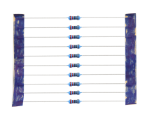
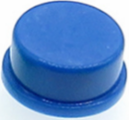
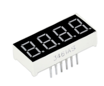
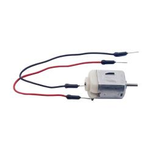
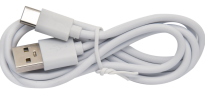

产品简介与清单
==============

**1.产品简介：**

你想学习编程知识吗?

只要你对科学充满热情，敢于探索新事物，这个Keyes
入门学习套件基础工具包一定是你的最佳选择。这个工具包提供了Arduino编程、scratch图形化编程和mixly图形化编程。用一个控制器（Plus控制板），许多传感器/模块和电子元件，你可以做许多精彩的DIY项目。该工具包的附带20个项目教程，每个教程都有详细的接线图、元件知识和迷人的项目代码等，完全适合初学者。你可以学习电子、物理、科学和编程很多知识。

**2.清单：**

当收到这个Keyes
入门学习套件基础工具包的时候，首先看到是一个包装精美的外盒，每个配件被安全且有序的装在外盒里面的小袋子里，先来清点一下：\ **(KE3014含Plus开发板，KE3013不含Plus开发板)**

+-------------+--------------+-----------------+-----------------+---------------+---------------+--------------+
| |image1|    | |image2|     | |image3|        | |image4|        | |image5|      | |image6|      | |image7|     |
+=============+==============+=================+=================+===============+===============+==============+
| Plus        | 蓝色LED\* 10 | 红色LED\* 10    | 黄色LED\* 10    | 绿色LED\* 10  | 白色LED\* 10  | RGB \*1      |
| 开发板*1    |              |                 |                 |               |               |              |
+-------------+--------------+-----------------+-----------------+---------------+---------------+--------------+
| |image8|    | |image9|     | |image10|       | |image11|       | |image12|     | |image13|     | |image14|    |
+-------------+--------------+-----------------+-----------------+---------------+---------------+--------------+
| 220Ω电阻*10 | 10KΩ电阻*10  | 1KΩ电阻*10      | 4.7KΩ电阻*10    | 10KΩ电位器*1  | 有源蜂鸣器*1  | 无源蜂鸣器*1 |
+-------------+--------------+-----------------+-----------------+---------------+---------------+--------------+
| |image15|   | |image16|    | |image17|       | |image18|       | |image19|     | |image20|     | |image21|    |
+-------------+--------------+-----------------+-----------------+---------------+---------------+--------------+
| 按键开关*4  | 倾斜开关*1   | 光敏电阻*3      | 火焰传感器*1    | 10K热敏电阻*1 | 黄帽*2        | 蓝帽*2       |
+-------------+--------------+-----------------+-----------------+---------------+---------------+--------------+
| |image22|   | |image23|    | |image24|       | |image25|       | |image26|     | |image27|     | |image28|    |
+-------------+--------------+-----------------+-----------------+---------------+---------------+--------------+
| IC 74HC595N | 一位数码管*1 | 四位数码管*1    | 8\ *8点阵屏*\ 1 | 1602 I2C LCD  | S8050三极管*2 | S8550三极*2  |
| \*1         |              |                 |                 | \*1           |               |              |
+-------------+--------------+-----------------+-----------------+---------------+---------------+--------------+
| |image29|   | |image30|    | |image31|       | |image32|       | |image33|     | |image34|     | |image35|    |
+-------------+--------------+-----------------+-----------------+---------------+---------------+--------------+
| 风扇叶*1    | 直流电机*1   | 面包板连接线*30 | 公对母杜邦线*10 | 400孔面包板*1 | USB线*1       | 电阻卡*1     |
+-------------+--------------+-----------------+-----------------+---------------+---------------+--------------+

.. |image1| image:: media/d1918aec02b05734a1d32592a46ddd1a.png
.. |image2| image:: media/5a1d3dbf0c5daf6136044b828a777acd.png
.. |image3| image:: media/cddded49c863ef913bbe2ef3832da74b.png
.. |image4| image:: media/679ad0aaef0b7b199aaf0967e1aa5367.png
.. |image5| image:: media/0eead4be7850896afc83477bd7c260d8.png

.. |image7| image:: media/4a72a2edc72d11085c1379ba188038e9.png

.. |image9| image:: media/1baebd241a5c0654eb9bc571db904683.png
.. |image10| image:: media/0113c0595ce216f178c0948f77efd03e.png
.. |image11| image:: media/fcff9bef757327b78b545fd9193b9397.png
.. |image12| image:: media/d0a42506a43071b51bc17f9e39caa37c.png
.. |image13| image:: media/60a660b4c23562a74563483b7af3f568.png
.. |image14| image:: media/5444cd34945d9cc2dbb825a8be8d49ad.png
.. |image15| image:: media/5b8fea4657b47510d199f740fdcaaa9d.png
.. |image16| image:: media/f2b0fe5c69eada37beef36022ae03974.png

.. |image18| image:: media/adb25a98a644070c6de378fe98017d8b.png
.. |image19| image:: media/b45bb81bb3763377c63accce606ac5f2.png
.. |image20| image:: media/8defa4d3994ce0f2291b05c2fd04ee9c.png

.. |image22| image:: media/e5756d5b6983fb93087e49a42482dcb8.png
.. |image23| image:: media/c88b647385c69cfc1a6746a3c459ab12.png

.. |image25| image:: media/d226a1f3c801ac78321f0692143c853e.png
.. |image26| image:: media/a63cc057fe7d72e8c84bf08d8aad6465.jpeg
.. |image27| image:: media/9197d4aff9356c585b7ef68e33a6881d.png
.. |image28| image:: media/9197d4aff9356c585b7ef68e33a6881d.png
.. |image29| image:: media/009965e315276ecf1144c22c54a93fd9.png

.. |image31| image:: media/fac0503511e41d3a6c1aad355baa7abb.png
.. |image32| image:: media/6a11918efdd9458fcbed69415b01934b.png
.. |image33| image:: media/d5ce8dd2cc3fcf2acd49a27962911606.png

.. |image35| image:: media/89aaafefa692d400a031a0e213879c56.png
